## Airline Customer Satisfaction Report
**Pavan Kumar Chintala, Pramod Varma Chodraju**
### Introduction
The airline industry is highly competitive, and understanding factors that contribute to customer satisfaction is crucial for airlines to maintain and improve their services. This report analyzes a dataset containing information about airline passengers and their satisfaction levels based on various service aspects. By exploring and analyzing this data, we aim to identify the key factors that influence customer satisfaction.

Our Dataset has following attributes:
### Attributes:
#### Customer Identification:
- id: A unique identifier for each customer.
- Gender: The gender of the customer (Male/Female).
- Customer Type: Categorization into 'Loyal' or 'disloyal' customers,      probably based on frequency of travel or membership in a loyalty program.

#### Travel Profile:
- Age: The age of the customer.
- Type of Travel: Differentiates between personal and business travel.
- Class: The travel class (Eco, Eco Plus, or Business).
- Flight Distance: The length of the flight in question.

#### Service Ratings:
- Ratings on a scale (likely 1-5) for various services including Inflight wifi service, Ease of Online booking, Gate location, Food and drink, Online boarding, Seat comfort, Inflight entertainment, On-board service, Leg room service, Baggage handling, Checkin service, Inflight service, and Cleanliness.

#### Delay Information:
-  Departure Delay in Minutes and Arrival Delay in Minutes: These columns provide quantitative data on the duration of delays, which can be a critical factor in overall customer satisfaction.

#### Satisfaction:
- The final column, satisfaction, seems to be an overall satisfaction metric, categorized qualitatively as 'satisfied', 'neutral or dissatisfied'.

### Data Dictionary
Our Dataset has 129880 rows and 23 columns
| Sl No. | Variable                     | Data Type   | Null Value Check     |
| ------ | ---------------------------- | ----------- | -------------------- |
| 1      | Gender                       | Categorical | 129880 not-null      |
| 2      | Customer Type                | Categorical | 129880 not-null      |
| 3      | Age                          | Numerical   | 129880 not-null      |
| 4      | Type of Travel               | Categorical | 129880 not-null      |
| 5      | Class                        | Categorical | 129880 not-null      |
| 6      | Flight distance              | Numerical   | 129880 not-null      |
| 7      | Inflight wifi service        | Numerical   | 129880 not-null      |
| 8      | Departure/Arrival time convenient | Numerical   | 129880 not-null      |
| 9      | Ease of Online booking       | Numerical   | 129880 not-null      |
| 10     | Gate location                | Numerical   | 129880 not-null      |
| 11     | Food and drink               | Numerical   | 129880 not-null      |
| 12     | Online boarding              | Numerical   | 129880 not-null      |
| 13     | Seat comfort                 | Numerical   | 129880 not-null      |
| 14     | Inflight entertainment       | Numerical   | 129880 not-null      |
| 15     | On-board service             | Numerical   | 129880 not-null      |
| 16     | Leg room service             | Numerical   | 129880 not-null      |
| 17     | Baggage handling             | Numerical   | 129880 not-null      |
| 18     | Check-in service             | Numerical   | 129880 not-null      |
| 19     | Inflight service             | Numerical   | 129880 not-null      |
| 20     | Cleanliness                  | Numerical   | 129880 not-null      |
| 21     | Departure Delay in Minutes   | Numerical   | 129880 not-null      |
| 22     | Arrival Delay in Minutes     | Numerical   | 129487 not-null      |
| 23     | Satisfaction                 | Categorical | 129880 not-null      |


### Purpose and Use
This dataset could be useful for improving customer service by identifying key factors that contribute to satisfaction or dissatisfaction, targeting areas for improvement, personalizing services for different customer segments, and ultimately enhancing the overall customer experience to foster loyalty and repeat business.

We collected this Dataset from Kaggle
[Airline Customer Satisfaction Data set](https://www.kaggle.com/datasets/teejmahal20/airline-passenger-satisfaction)

### Prediction Goal
The primary prediction goal from this dataset would be to forecast a customer's overall satisfaction based on the various service features and demographics. Specifically, we would aim to predict the binary outcome for the satisfaction column, which is categorized as either 'satisfied' or 'neutral or dissatisfied'.

### Process Overview
- We first preprocessed the data (Removing Null Values and Unneccesary data)
- Encoded the categorical variables
- Developed seperate models for each class (Business Class, Economy Class)
  - we combined the Eco and Eco Plus as they are similar and named it as Eco
  which we basically call Economy Class
#### Models Developed
- Logistic Regression
- Decision Tree
- Random Forest
### Model Comparison
### For Business Class Customers

| MODEL NAMES | ACCURACY |
| --------|-------- |
| LOGISTIC REGRESSION | 0.871 |
| DECISION TREE | 0.9609 |
| RANDOM FOREST | 0.9736 |

### For Economy Class Customers

| MODEL NAMES | ACCURACY |
| --------|-------- |
| LOGISTIC REGRESSION | 0.879 |
| DECISION TREE | 0.9245 |
| RANDOM FOREST | 0.9411 |

### Exploratory Data Analysis

### Skewness
Skewness measures the degree of asymmetry of a distribution around its mean. Positive skew indicates a distribution with an extended tail on the right side, and negative skew indicates a tail on the left side.


| Feature                              | Value     |
|--------------------------------------|-----------|
| Age                                  | -0.003606 |
| Flight Distance                      | 1.108142  |
| Inflight wifi service                | 0.040465  |
| Departure/Arrival time convenient    | -0.332469 |
| Ease of Online booking               | -0.018779 |
| Gate location                        | -0.058265 |
| Food and drink                       | -0.155063 |
| Online boarding                      | -0.456911 |
| Seat comfort                         | -0.485818 |
| Inflight entertainment               | -0.366385 |
| On-board service                     | -0.421320 |
| Leg room service                     | -0.348414 |
| Baggage handling                     | -0.677400 |
| Checkin service                      | -0.366569 |
| Inflight service                     | -0.691580 |
| Cleanliness                          | -0.300926 |
| Departure Delay in Minutes           | 6.821980  |
| Arrival Delay in Minutes             | 6.670125  |
| Satisfaction                         | 0.264434  |

#### Analysis
- Age: The skewness close to zero suggests that the age distribution is nearly symmetric.
- Flight Distance: A positive skewness (1.108142) indicates that more passengers tend to travel shorter distances, with fewer traveling longer distances.
- Departure and Arrival Delays: Both features show high positive skewness, suggesting that most flights are on time or have minor delays, but a few flights have very long delays.
- Service Attributes (e.g., Inflight service, Baggage handling): Negative values indicate that the dissatisfaction (or lower ratings) tail is longer; many passengers are satisfied, but a significant minority are not, pulling the skew to the left.
### UniVariate Analysis

#### Gender:
There is a fair distribution of all categories in Gender. There are 2 categories in total Male and Female. The Gender Female has the maximum number of contributions in data with a percentage share of 50.7% and rest are Males.

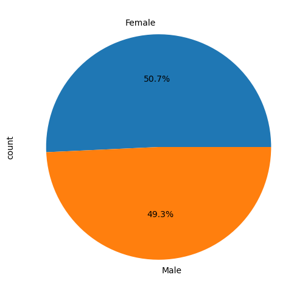

#### Type of Travel:
There are two categories in Type of Travellers: Business travellers and Personal travellers. Business travels have more occurrence compared to Personal travels with 69.1% for Business travel and remaining for Personal travel.

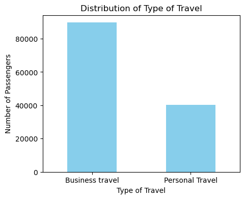

#### Customer Type:
We have two categories in the customer type column which are a set of loyal customers and another set of disloyal customers . In this feature there is quite an imbalance in the data, from which we can interpret that the loyal customer base is more compared to the disloyal customer base .We have 81.17 % of loyal customers of the airlines and the rest 18.2% fall under the category of disloyal customers.

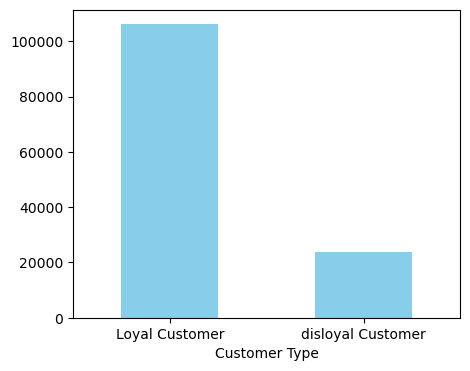

#### Class:
There are 3 classes of passengers for the airline which consists of Business class,Economy class and Economy + class. Our whole set of passengers fall into these three categories at values of 47.7%, 44.9%,7.2% respectively from which we can interpret that most passengers tend to choose Business class and very few passengers opt for the Economy plus. 

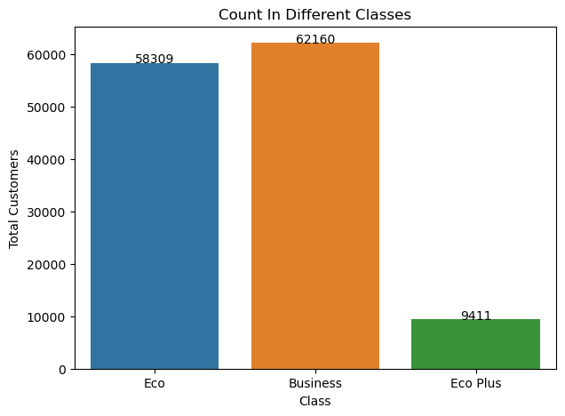

Here we combined Eco and Eco plus for balancing the data run multi models.

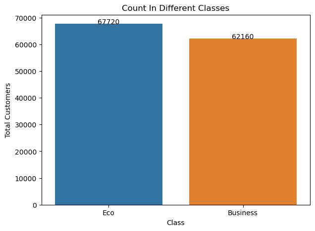

#### Online Boarding:
Online boarding features tells us how satisfied the passengers were in the process of online boarding.With an average score of 3.25 it can be interpreted as the passengers were slightly satisfied with the online boarding service . While most of them rated the feature with 4 stars.

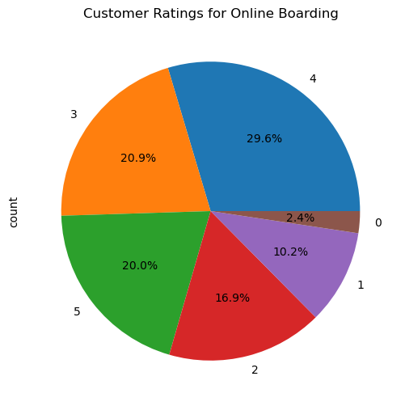

### Bivariate Analysis
#### Flight Distance vs Departure Delay
The Following Plot displays the relationship between the distance a flight is scheduled to cover and the length of delay it experienced before departure. The x-axis, labeled 'Flight Distance', likely represents the total distance of the flight in miles or kilometers, and the y-axis, labeled 'Departure Delay in Minutes', shows how many minutes the flight was delayed.

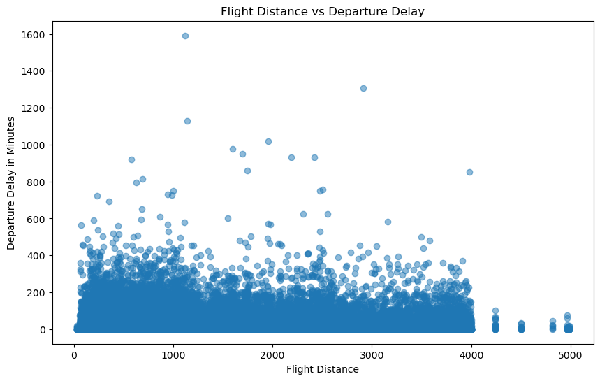

#### Age Distribution by Type of Travel
The below plot shows relationship between the age of the passengers and their type of travel. It shows the distribution of ages among those who travel for personal reasons versus those who travel for business. From the boxplot, you can observe the central tendency, spread, and any potential outliers in age for both categories of travel.

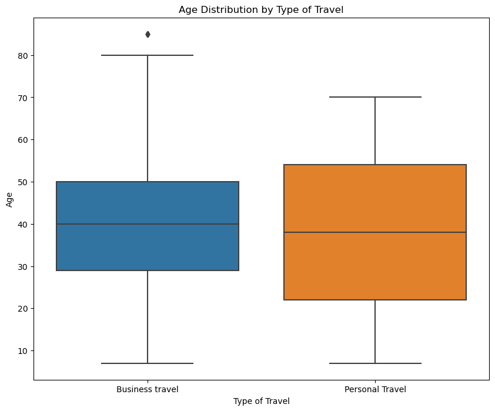

#### Class Vs Satisfaction

The following stacked bar chart shows compares the satisfaction levels of passengers across three different travel classes offered by an airline: Business, Eco.

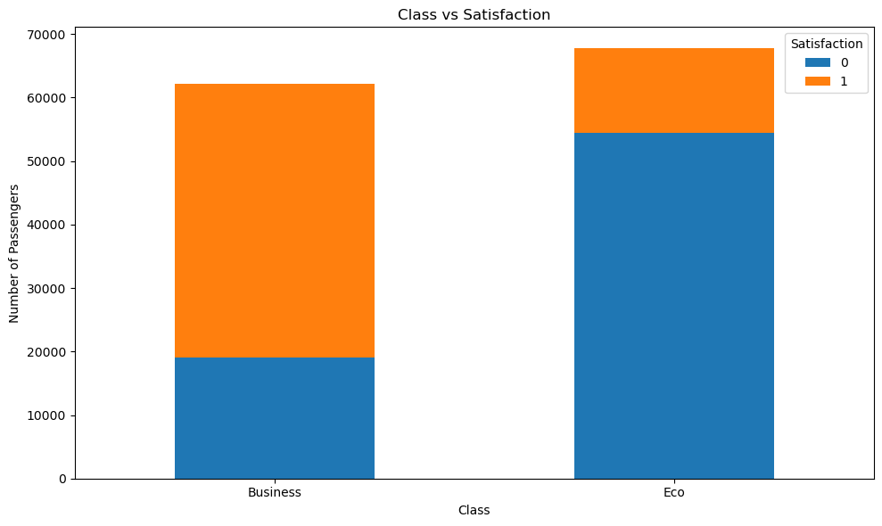

### Correlation 

Below is the correlation plot representing all the features in our data and the relation between all the features.

'Online boarding' and 'Inflight entertainment', show relatively stronger positive correlations with customer satisfaction, suggesting that improvements in these areas may potentially lead to higher customer satisfaction levels.

Whereas, 'Departure Delay in Minutes', 'Arrival Delay in Minutes' both show a slightly negative relationship with satisfaction, indicating that as delays increase, customer satisfaction tends to decrease, although the relationship is not strongly marked.

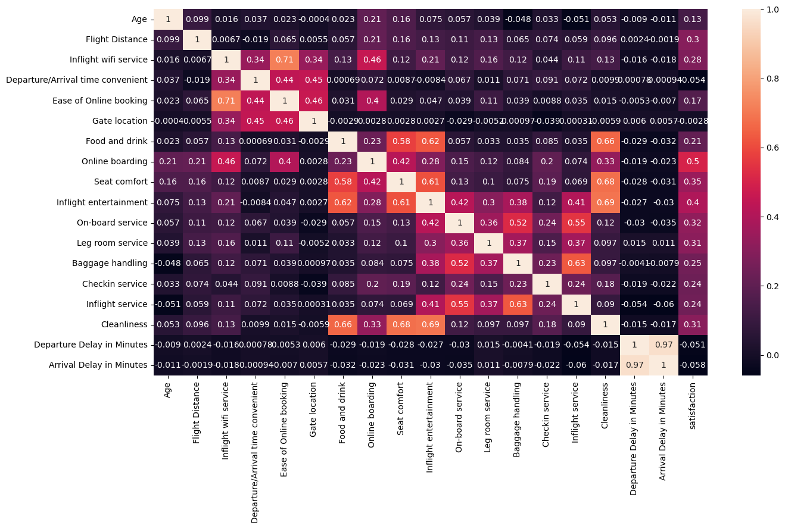

### Feature Engineering

#### Outliers

Outliers can have a significant impact on statistical analyses and can be a result of errors in data entry, measurement, or they can be genuine extreme values. In statistical terms, an outlier is often considered a data point that is located far from other similar points. In the context of the airline data, we might consider extreme delay times or extreme ages as potential outliers.

One common method to identify outliers is to use the interquartile range (IQR). The IQR is the difference between the 75th percentile (Q3) and the 25th percentile (Q1) in the data. Any data point that is more than 1.5 times the IQR above the 75th percentile and below the 25th percentile is typically considered an outlier.

```python
def remove_outliers(df, columns):
    for column in columns:
        Q1 = df[column].quantile(0.25)
        Q3 = df[column].quantile(0.75)
        IQR = Q3 - Q1
        lower_bound = Q1 - 1.5 * IQR
        upper_bound = Q3 + 1.5 * IQR
        df = df[(df[column] >= lower_bound) & (df[column] <= upper_bound)]
    return df

numerical_columns = ['Age', 'Flight Distance', 'Departure Delay in Minutes', 'Arrival Delay in Minutes']

df_cleaned = remove_outliers(df, numerical_columns)
```
#### Converting Categorical variables to Numerical

#### Label Encoders

Label encoding is a technique used to convert categorical data into a numerical format. It's applied to the labels of categories so that they can be read and processed by algorithms that require numerical input.
```python
label_encoders = {}
for column in ['Gender', 'Customer Type','Type of Travel', 'Class', 'satisfaction']:
    le = LabelEncoder()
    df_b[column] = le.fit_transform(df_b[column])
    label_encoders[column] = le
```

#### Manual Encoding
Each categorical variable is mapped to a unique integer based on a custom dictionary you provide, where the keys are the original text categories and the values are the corresponding integers you want to assign.

```python
df1_b['Gender'] = df1_b['Gender'].map({'Male': 0, 'Female': 1})
df1_b['Customer Type'] = df1_b['Customer Type'].map({'Loyal Customer': 0, 'disloyal Customer': 1})
df1_b['Type of Travel'] = df1_b['Type of Travel'].map({'Personal Travel': 0, 'Business travel': 1})
df1_b['Class'] = df1_b['Class'].map({'Eco': 0, 'Business': 1})
```

### Model Fitting
In our analysis of airline customer satisfaction, we recognized the distinct characteristics and needs of passengers traveling in different service classes. To tailor our predictive models to these differences, we opted to develop separate models for the 'Business' class and 'Eco' class passengers.

This decision was driven by the hypothesis that passengers in different classes might prioritize different aspects of their travel experience, influencing their overall satisfaction differently. By segmenting the models according to class, we aimed to capture these nuances more accurately, ensuring that our predictions are more precise and relevant for each passenger segment.

#### Train / test splitting
The process of splitting a dataset into training and testing sets is a crucial step in machine learning for evaluating the performance of models. Here's an overview of how this splitting is typically performed and how one might decide on the train/test sizes

The splitting of the data can be conveniently done using libraries such as scikit-learn. The train_test_split function is commonly used for this purpose.

```python
from sklearn.model_selection import train_test_split

# X represents the feature columns, y is the target variable
X_train, X_test, y_train, y_test = train_test_split(X, y, test_size=0.2, random_state=42)
```

#### Train/Test Sizes:
We choose the training and testing size depending of various factors like
- Size of Dataset
- Cross Validation
- Domain-Specific Standards
- Model Complexity

Each model was trained using a split of 80% training data and 20% testing data. We assessed model performance using accuracy, precision, recall, and F1-score. Additionally, confusion matrices were generated to understand the nature of any misclassifications and to further refine the models.

The segmented modeling approach allowed for a more tailored analysis, where each model could focus on the predictive variables most relevant to its respective class. Preliminary results indicated improved accuracy for each model compared to a single model approach. For instance, the Business class model was particularly effective at predicting satisfaction based on in-flight service quality, whereas the Eco class model was more sensitive to factors like seat comfort and cleanliness.


### Base Model
### Logistic Regression:
It is a classification algorithm in machine learning that uses one or more independent variables to determine an outcome. The outcome is measured with a dichotomous variable meaning it will have only two possible outcomes. The goal of logistic regression is to find a best-fitting relationship between the dependent variable and a set of independent variables. It is better than other binary classification algorithms like nearest neighbour since it quantitatively explains the factors leading to classification.

Logistic regression is named for the function used at the core of the method, the logistic function. The logistic function, also called the sigmoid function was developed by statisticians to describe properties of population growth in ecology, rising quickly and maxing out at the carrying capacity of the environment. It’s an S-shaped curve that can take any real-valued number and map it into a value between 0 and 1, but never exactly at those limits. 1 / (1 + e^-value), Where ‘e’ is the base of the natural logarithms (Euler’s number or the EXP () function in your spreadsheet) and value is the actual numerical value that you want to transform. Below is a plot of the numbers between -5 and 5 transformed into the range 0 and 1 using the logistic function.

```python
from sklearn.linear_model import LogisticRegression
```

#### For Business Class:
Training Accuracy: 0.8698695603283482

Testing Accuracy: 0.8719361367213853

#### Classification Report:
|            | Precision | Recall | F1-score | Support |
|------------|-----------|--------|----------|---------|
| Class 0    | 0.79      | 0.75   | 0.77     | 2527    |
| Class 1    | 0.90      | 0.92   | 0.91     | 6367    |
|            |           |        |          |         |
| Accuracy   |           |        | 0.87     | 8894    |
| Macro Avg  | 0.85      | 0.83   | 0.84     | 8894    |
| Weighted Avg | 0.87    | 0.87   | 0.87     | 8894    |

#### Confusion Matrix:

|               | Predicted: No | Predicted: Yes |
|---------------|---------------|----------------|
| **Actual: No**  | 1890          | 637            |
| **Actual: Yes** | 502           | 5865           |

#### For Economy Class:
**Training Accuracy**: 0.8773218251564708

**Testing Accuracy**: 0.8796688875429033
#### Classification Report:
|           | Precision | Recall | F1-score | Support |
|-----------|-----------|--------|----------|---------|
| Class 0   | 0.89      | 0.97   | 0.93     | 7778    |
| Class 1   | 0.82      | 0.56   | 0.67     | 2128    |
|           |           |        |          |         |
| Accuracy  |           |        | 0.88     | 9906    |
| Macro Avg | 0.86      | 0.76   | 0.80     | 9906    |
| Weighted Avg | 0.88    | 0.88   | 0.87     | 9906    |
#### Confusion Matrix:
|              | Predicted: No | Predicted: Yes |
|--------------|---------------|----------------|
| **Actual: No**   | 7524          | 254            |
| **Actual: Yes**  | 938           | 1190           |

These tables present a clear and professional format for conveying the performance of a classification model in your report, including detailed metrics for precision, recall, f1-score, and the structure of the confusion matrix. This format helps readers quickly grasp how well the model performs across different classes.

### Classification Model
### DECISION TREE:
A decision tree is a tree-based supervised learning method used to predict the output of a target variable. Supervised learning uses labelled data (data with known output variables) to make predictions with the help of regression and classification algorithms. Supervised learning algorithms act as a supervisor for training a model with a defined output variable. It learns from simple decision rules using the various data features. Decision trees in Python can be used to solve both classification and regression problems—they are frequently used in determining odds 37 Advantages of Using Decision Trees: 
- Decision trees are simple to understand, interpret, and visualize.
- They can effectively handle both numerical and categorical data.
- They can determine the worst, best, and expected values for several scenarios.
- Decision trees require little data preparation and data normalization 
- They perform well, even if the actual model violates the assumptions

```python
from sklearn.tree import DecisionTreeClassifier
```
#### Decision Tree Applications:
A decision tree is used to determine whether an applicant is likely to default on a loan. It can be used to determine the odds of an individual developing a specific disease. It can help ecommerce companies in predicting whether a consumer is likely to purchase a specific product.
Decision trees can also be used to find customer churn rates. 
Important Terms Used in Decision Trees: 
##### Entropy: 
Entropy is the measure of uncertainty or randomness in a data set. Entropy handles how a decision tree splits the data. It is calculated using the following formula: 
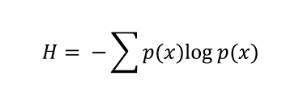


##### Information Gain: 
The information gain measures the decrease in entropy after the data set is split.
 	It is calculated as follows:   IG (Y, X) = Entropy (Y) - Entropy (Y | X) 
##### Gini Index: 
The Gini Index is used to determine the correct variable for splitting nodes. It measures how often a randomly chosen variable would be incorrectly identified.
##### Root Node:
The root node is always the top node of a decision tree. It represents the entire population or data sample, and it can be further divided into different sets. 
##### Decision Node:
Decision nodes are sub nodes that can be split into different sub nodes; they contain at least two branches. 
##### Leaf Node:
A leaf node in a decision tree carries the final results. These nodes, which are also known as terminal nodes, cannot be split any further. In machine learning, we use decision trees also to understand classification, segregation, and arrive at a numerical output or regression. 

In an automated process, we use a set of algorithms and tools to do the actual process of decision making and branching based on the attributes of the data. The originally unsorted data at least according to our needs must be analysed based on a variety of attributes in multiple steps and segregated to reach lower randomness or achieve lower entropy. While completing this segregation (given that the same attribute may appear more than once), the algorithm needs to consider the probability of a repeat occurrence of an attribute. Therefore, we can also refer to the decision tree as a type of probability tree.
The data at the root node is quite random, and the degree of randomness or messiness is called entropy. As we break down and sort the data, we arrive at a higher degree of accurately-sorted data and achieve different degrees of information, or ‘“Information gain.”
### For Business Class
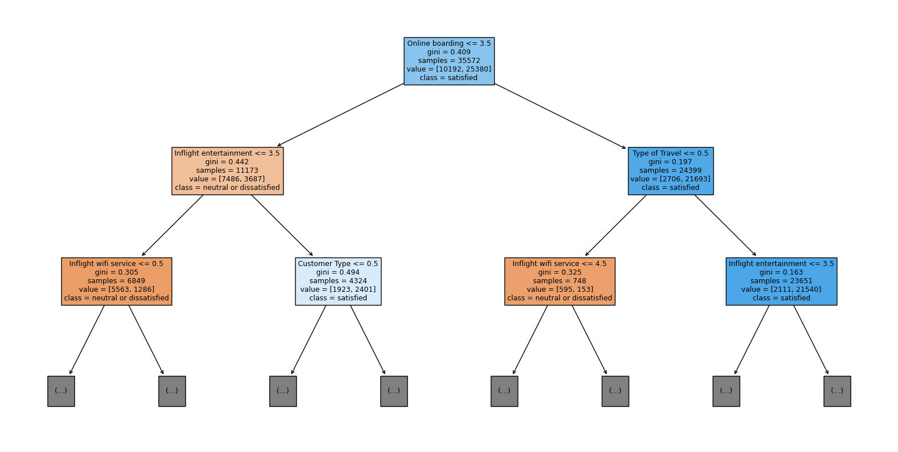

**Accuracy**: 0.948
#### Root Node:

- At the top, the root node represents the entire dataset. It splits based on a feature that results in the best differentiation of the target variable.
- In this case, the root node splits on "Inflight entertainment <= 3.5", implying that this feature is significant in predicting the target.
#### Branches and Internal Nodes:

- The tree branches into nodes, with each internal node representing a decision based on another feature.
- The first split on the left is based on "Inflight wifi service <= 0.5", and on the right, "Online boarding <= 3.5".
- The subsequent split on the left of the right branch is made on "Type of Travel <= 0.5".
#### Leaf Nodes:
- These are the terminal nodes that give the decision or prediction outcome, labeled with the class.
- The leaf nodes aren't fully visible in this image, but they would normally indicate the predicted class based on the criteria from the root to that leaf.
#### Value:

- The array shows the distribution of classes in the samples at that node. The first number indicates the count of the first class, while the second is the count of the second class.
#### Class:

- This indicates the majority class of the samples in the node. For instance, "class = neutral or dissatisfied" or "class = satisfied" shows which class is more prevalent in each node.\

#### Classification Report:

|               | Precision | Recall | F1-score | Support |
|---------------|-----------|--------|----------|---------|
| **Class 0**   | 0.91      | 0.91   | 0.91     | 2527    |
| **Class 1**   | 0.96      | 0.96   | 0.96     | 6367    |
|               |           |        |          |         |
| **Accuracy**  |           |        | 0.95     | 8894    |
| **Macro Avg** | 0.94      | 0.94   | 0.94     | 8894    |
| **Weighted Avg** | 0.95   | 0.95   | 0.95     | 8894    |

#### Confusion Matrix:  
|              | Predicted: No | Predicted: Yes |
|--------------|---------------|----------------|
| **Actual: No**   | 2303          | 224            |
| **Actual: Yes**  | 235           | 6132           |
### For Economy Class
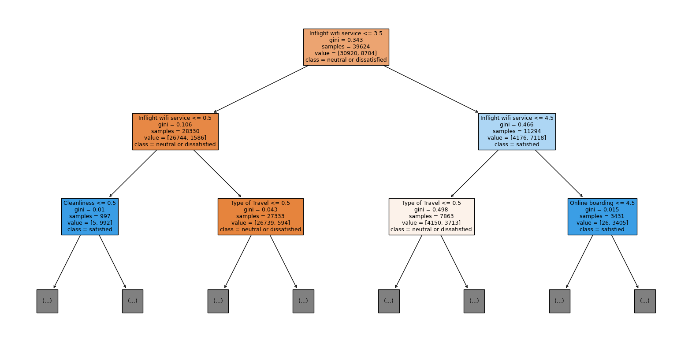

**Accuracy**: 0.9245
#### Root Node:

- The tree starts with the root node at the top, which tests a condition on the "Inflight wifi service" feature, specifically whether its value is less than or equal to 0.5. This initial split divides the dataset based on the Gini impurity score, which measures the dataset's homogeneity.
#### Internal Nodes:

- From the root, the tree branches out based on different conditions, each represented by an internal node. For instance, one of the subsequent nodes checks the "Type of Travel" feature with a threshold of 0.5. These nodes are chosen to best separate the samples into homogeneous subgroups that improve the purity of the nodes.

#### Leaf Nodes:

- While the leaf nodes are not fully visible, they are the endpoints of the tree where no further splitting occurs. They provide the predicted class labels based on the criteria followed along the path from the root to that leaf.

#### Value:

- The "value" lists the distribution of class labels among the samples at that node, showing how many samples belong to each class.
#### Class:

- This shows the majority class of samples in the node, which would be the predicted class if the decision tree classification stops at that node.
#### Classification Report:
|               | Precision | Recall | F1-score | Support |
|---------------|-----------|--------|----------|---------|
| **Class 0**   | 0.96      | 0.95   | 0.95     | 7778    |
| **Class 1**   | 0.82      | 0.84   | 0.83     | 2128    |
|               |           |        |          |         |
| **Accuracy**  |           |        | 0.92     | 9906    |
| **Macro Avg** | 0.89      | 0.89   | 0.89     | 9906    |
| **Weighted Avg** | 0.93   | 0.92   | 0.92     | 9906    |

#### Confusion Matrix:
|              | Predicted: No | Predicted: Yes |
|--------------|---------------|----------------|
| **Actual: No**   | 7378          | 400            |
| **Actual: Yes**  | 347           | 1781           |

### Random Forest 
Random Forest is an ensemble machine learning technique capable of performing both regression and classification tasks using multiple decision trees and a statistical technique called bagging. Bagging along with boosting are two of the most popular ensemble techniques which aim to tackle high variance and high bias. A RF instead of just averaging the prediction of trees it uses two key concepts that give it the name random.

Random sampling of training observations when building trees Random subsets of features for splitting nodes In other words, Random forest builds multiple decision trees and merge their predictions together to get a more accurate and stable prediction rather than relying on individual decision trees. 
```python
from sklearn.ensemble import RandomForestClassifier
```
#### Random sampling of training observations: 
Each tree in a random forest learns from a random sample of the training observations. The samples are drawn with replacement, known as bootstrapping, which means that some samples will be used multiple times in a single tree. The idea is that by training each tree on different samples, although each tree might have high variance with respect to a particular set of the training data, overall, the entire forest will have lower variance but not at the cost of increasing the bias. 

In the Sklearn implementation of Random forest the sub-sample size of each tree is always the same as the original 39 input sample size but the samples are drawn with replacement if bootstrap=True. If bootstrap=False each tree will use exactly the same dataset without any randomness. 

#### Random Subsets of features for splitting nodes: 
The other main concept in the random forest is that each tree sees only a subset of all the features when deciding to split a node. In Skearn this can be set by specifying max_features = sqrt(n_features) meaning that if there are 16 features, at each node in each tree, only 4 random features will be considered for splitting the node.

### For Business Class
**Accuracy**: 0.9736
#### Classification Report
|               | Precision | Recall | F1-score | Support |
|---------------|-----------|--------|----------|---------|
| **Class 0**   | 0.96      | 0.95   | 0.95     | 2527    |
| **Class 1**   | 0.98      | 0.98   | 0.98     | 6367    |
|               |           |        |          |         |
| **Accuracy**  |           |        | 0.97     | 8894    |
| **Macro Avg** | 0.97      | 0.97   | 0.97     | 8894    |
| **Weighted Avg** | 0.97   | 0.97   | 0.97     | 8894    |
#### Confusion Matrix
|               | Predicted Class 0 | Predicted Class 1 |
|---------------|-------------------|-------------------|
| **Actual Class 0** | 2406              | 121               |
| **Actual Class 1** | 113               | 6254              |

#### ROC curve for Business Class
An ROC curve plots the true positive rate (TPR) against the false positive rate (FPR) at various threshold settings. The true positive rate is also known as sensitivity, recall, or probability of detection in different areas. The false positive rate is also known as the probability of false alarm and can be calculated as (1 - specificity).   

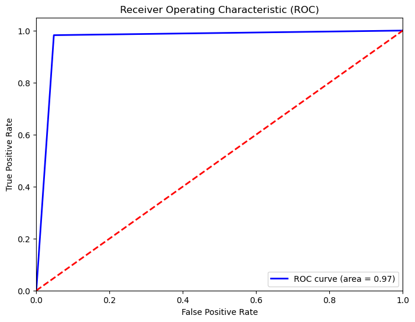
- The blue line represents the ROC curve of a classification model.
- The area under the curve (AUC) is mentioned as 0.97, which indicates a high level of discrimination ability for the classifier. This means the model is able to differentiate between the positive and negative classes with 97% probability.
- The closer the ROC curve follows the left-hand border and then the top border of the ROC space, the more accurate the test.
- The dotted red line represents the line of no-discrimination, which is the diagonal line that runs from the bottom left corner to the top right corner. This would be the result of a random guess or a non-discriminatory model.
- A model with perfect discrimination would have a point at the top left corner of the graph, where the true positive rate is 1 (100%) and the false positive rate is 0 (0%).

**ROC AUC Score:** 0.9671

### For Economy Class
**Accuracy**: 0.9411
#### Classification Report
|               | Precision | Recall | F1-score | Support |
|---------------|-----------|--------|----------|---------|
| **Class 0**   | 0.94      | 0.98   | 0.96     | 7778    |
| **Class 1**   | 0.93      | 0.79   | 0.85     | 2128    |
|               |           |        |          |         |
| **Accuracy**  |           |        | 0.94     | 9906    |
| **Macro Avg** | 0.94      | 0.89   | 0.91     | 9906    |
| **Weighted Avg** | 0.94   | 0.94   | 0.94     | 9906    |

#### Confusion Matrix
|               | Predicted Class 0 | Predicted Class 1 |
|---------------|-------------------|-------------------|
| **Actual Class 0** | 7647              | 131               |
| **Actual Class 1** | 452               | 1676              |

#### ROC curve for Economy Class
An ROC curve plots the true positive rate (TPR) against the false positive rate (FPR) at various threshold settings. The true positive rate is also known as sensitivity, recall, or probability of detection in different areas. The false positive rate is also known as the probability of false alarm and can be calculated as (1 - specificity).

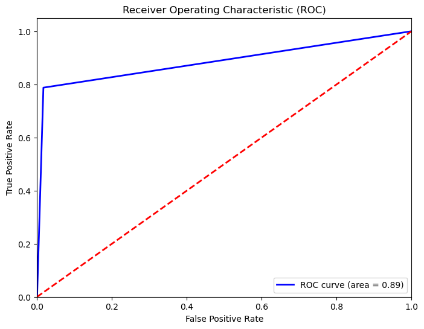
- The curve starts at the bottom left of the plot and rises towards the top left corner, indicating that the model has good discriminatory power.
- The closer the curve comes to the top left corner, the better the model is at distinguishing between the positive and negative classes.
- The area under the ROC curve (AUC) is 0.89, which is quite high, suggesting that the model has a good measure of separability. The AUC is a single scalar value that summarizes the performance of the model across all classification thresholds.
- The diagonal dashed red line represents the ROC curve of a random classifier (AUC = 0.5). The blue ROC curve is clearly above the red line, indicating that the model performs better than random chance.

**ROC AUC Score**: 0.8853

### Observations
#### High Overall Accuracy:
- The models consistently show high accuracy scores, implying a strong performance in classifying the positive and negative cases correctly across all classes.

#### Class-specific Performance:

- Class 0 (presumably the negative class) is identified with high precision and recall, indicating strong model performance in detecting this class.
- Class 1 (presumably the positive class) also shows good precision and recall, but there's a slightly greater challenge in predicting this class compared to Class 0, which is common in unbalanced datasets.

#### Excellent Area Under the ROC Curve (AUC):

- The ROC curves indicate excellent AUC scores, nearing 1, which means the model has a high true positive rate and a low false positive rate.
- These high AUC values suggest that the model has a good distinction capacity between positive and negative classes.

#### Macro and Weighted Averages:

- The macro average metrics are close to the weighted averages, indicating consistency in model performance across different classes.
- This consistency is especially important in datasets where classes might be imbalanced, ensuring that the model isn't biased towards the majority class.

#### Potential for Model Improvement:

- While the overall performance is strong, the difference in precision and recall between the classes suggests room for further tuning. For instance, Class 1 could potentially benefit from techniques aimed at balancing class weight or adjusting classification thresholds.
- The confusion matrices provide additional context, showing some misclassifications, particularly false negatives in Class 1. It suggests an area to focus on for improving the sensitivity of the model.

#### Model Robustness:

- The classification reports and ROC curves together indicate that the models are robust, with performance metrics suggesting they generalize well to the test data.
- The specificity and sensitivity shown by the models make them potentially very useful for practical applications where both the accurate identification of the positive class and the reduction of false alarms are crucial.

### Conclusion
In concluding the evaluation of three predictive models for our airline satisfaction dataset, the Random Forest algorithm emerged as the superior choice due to its robust performance across multiple metrics. The classification report for the Random Forest model demonstrated a high degree of accuracy, with an overall rate of 94%, and commendable precision and recall scores across both the majority and minority classes. These metrics were reinforced by the ROC analysis, which revealed an AUC of 0.89, signifying the model's strong discriminatory power between satisfied and dissatisfied customers.

From some of the simulations, I recommend that airlines should focus on improving the Inflight Wi-Fi Service experience.

For instance, airlines could develop better software to allow easier access to inflight wi-fi, or lower the cost to access inflight wi-fi such that more economy class customers can enjoy the service. 

In addition, airlines should also focus on Ease of Online Booking, as business passengers prioritize on ease and convenience in their travel.Finally, I hope that the model will provide a reference for airlines and be utilized for business value

### References
- Kaggle
- Google Scholar 
- Paper titled “Customer Satisfaction in the airline industry: The role of             service quality and price” from Asia Tourism Forum Conference, 2012. 
- Paper titled “Customer Satisfaction in Airline Industry” from    10.7763/IPEDR. 2014. V76. 12. 
